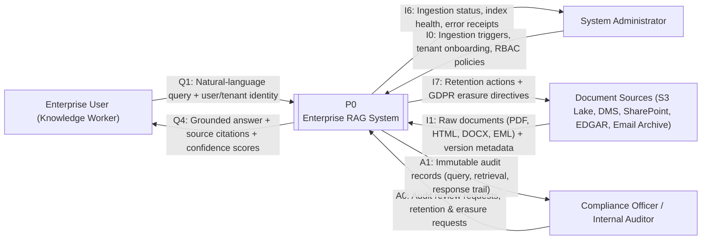
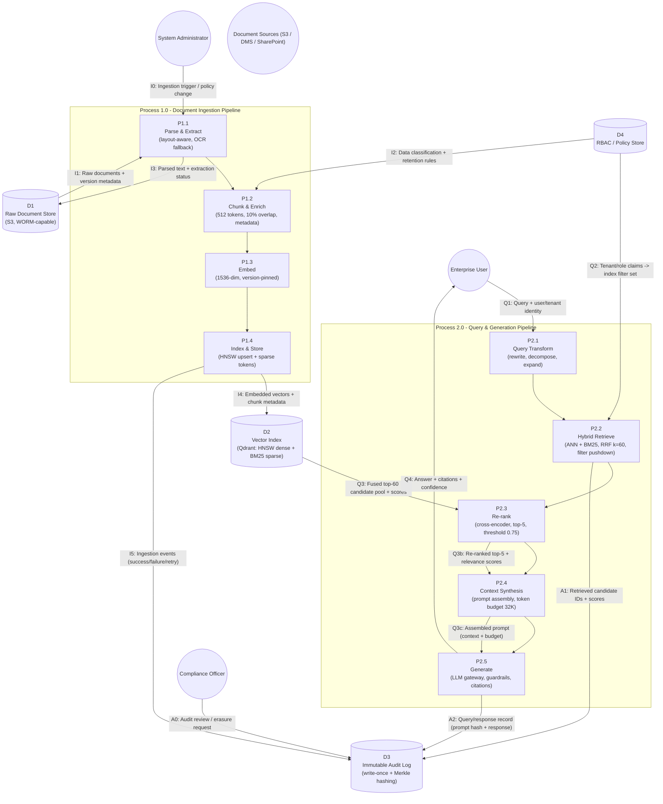

# Part 3 - Data Flow Diagrams (DFD Level 0 & Level 1, Mermaid.js)

**Notation conventions**

| Symbol | Meaning |
|---|---|
| Double circle `(( ))` | External entity (human actor / external system) |
| Rounded rectangle `[ ]` | Process (numbered P1.x / P2.x, Level 1) |
| Cylinder `[( )]` | Data store (numbered D1–D4) |
| Labeled arrow `-- "Q1" -->` | Data flow (ID, payload description) |
| Subgraph boundary | Process group / system boundary |

Data flow IDs follow the `Qn` (query path), `In` (ingestion path), `An` (audit path) conventions and are inventoried in §3.3.

## 3.1 DFD Level 0 — Context Diagram

Single process (P0 = the entire Enterprise RAG System) and its external entities. Exactly one process, per standard DFD Level 0 convention.

## 3.2 DFD Level 1 — Decomposed Data Flow

Decomposition of P0 into the **Ingestion Pipeline** (P1.1–P1.4) and the **Query & Generation Pipeline** (P2.1–P2.5), with data stores D1–D4.

## 3.3 Data Flow Inventory

| Flow ID | Source | Target | Payload | Frequency | Latency budget |
|---|---|---|---|---|---|
| I0 | System Administrator | P1.1 | Ingestion trigger, channel config, policy update | On-demand / scheduled | — |
| I1 | D1 / Document Sources | P1.1 | Raw document bytes + source version ID | Event-driven (S3) / batch (hourly feeds) | — |
| I2 | D4 | P1.2 | Classification tier, retention rules, tenant mapping | Per document batch | &lt; 50 ms |
| I3 | P1.1 | D1 | Parsed text, table structures, extraction status, page map | Per document | — |
| I4 | P1.4 | D2 | Dense vectors (1536-d), sparse BM25 postings, chunk metadata | Per chunk | — |
| I5 | P1.4 | D3 | Ingestion events: doc ID, status, latency, retries | Per document | — |
| I6 | P0 | System Administrator | Ingestion status, index health, error receipts | Polling / alerts | — |
| I7 | P0 | D1 / Document Sources | Retention deletions, GDPR erasure directives | On request (≤ 30 days) | — |
| Q1 | Enterprise User | P2.1 | Natural-language query + authenticated user/tenant identity | Per user query | &lt; 10 ms transport |
| Q2 | D4 | P2.2 | Tenant/role claims translated to index filter set | Per query | &lt; 10 ms |
| Q3 | D2 | P2.3 | Fused top-60 candidate pool + per-source scores | Per query | &lt; 150 ms |
| Q3b | P2.3 | P2.4 | Re-ranked top-5 + relevance scores | Per query | &lt; 120 ms |
| Q3c | P2.4 | P2.5 | Assembled prompt (context, system policy, budget ≤ 32K tokens) | Per query | &lt; 30 ms |
| Q4 | P2.5 | Enterprise User | Grounded answer + citations (doc ID, page/offset, chunk ID) + confidence | Per query | end-to-end P95 &lt; 800 ms |
| A0 | Compliance Officer | D3 | Audit review query, retention/erasure request | On demand | — |
| A1 | P2.2 | D3 | Retrieved candidate IDs, scores, applied filters | Per query, synchronous (≤ 20 ms overhead) | &lt; 20 ms |
| A2 | P2.5 | D3 | Query/response record: identity, prompt hash, response, model + embedding versions | Per query, synchronous | &lt; 20 ms |

## 3.4 Data Store Registry

| Store | Technology (per §2.5 C-T2) | Retention | Integrity controls |
|---|---|---|---|
| D1 Raw Document Store | S3 (WORM object-lock buckets for regulatory content) | Per classification tier: 7–30 years | Object versioning, SHA-256 manifest, KMS AES-256-SSE |
| D2 Vector Index | Qdrant on EKS (HNSW M=32, efSearch=128 + sparse vectors), 3-node replication | Correlates to D1; rebuildable | Tenant-partitioned collections, at-rest encryption, snapshot restore (RPO ≤ 5 min) |
| D3 Immutable Audit Log | S3 Object Lock (compliance mode) + Merkle root publication | 7 years (SOC 2) minimum | Append-only, per-block Merkle hashing, WORM, access via break-glass procedure |
| D4 RBAC / Policy Store | Policy-as-code repository + OPA evaluation service | Per policy lifecycle | Signed policy bundles, dual-admin approval, change audit to D3 |
