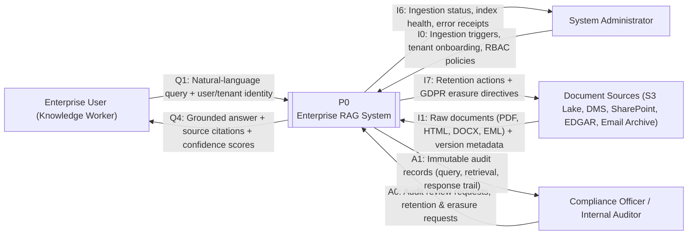
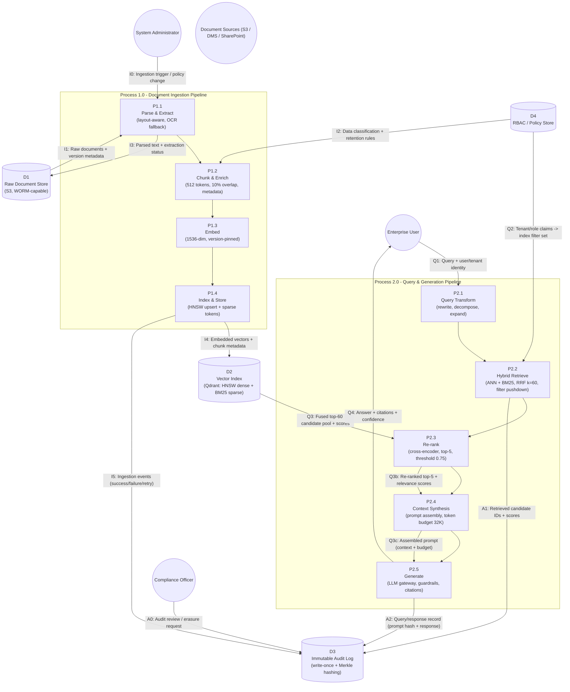

# Enterprise RAG System — Architecture & System Analysis Package

> **Status:** Synced working copy of the final package.
> **Source of truth:** `docs/01_requirement_analysis.md`, `docs/02_data_flow_diagrams.md`, `docs/03_spiral_sdlc_plan.md` (last synced 2026-10-01).
> **Part 1 script:** archived in this file (§ PART 1) — the executable `scripts/setup_docs.py` was removed from the repo at the owner's request (commit `087476c`) after `docs/` was generated.
> Both Mermaid diagrams validated with `mermaid.parse` → `flowchart-v2`. Setup script verified idempotent before removal (run 1 creates, run 2 skips, exit 0).

**Domain:** Financial Services | **Cloud:** AWS (us-east-1 primary a/b/c, eu-west-1 EU residency) | **Compliance:** SOC 2 Type II + GDPR | **Scale:** 10M+ docs, P95 < 800 ms, 99.9% uptime

---

## PART 1: Python Infrastructure Setup Script (archived copy)

> **Archived copy.** The executable lived at `scripts/setup_docs.py` and was removed from the repo at the owner's request (commit `087476c`); `docs/` was already generated by it. This section is the sole remaining copy of the script — paste it back to `scripts/setup_docs.py` if you ever need to re-scaffold or repair the tree.

Executable, idempotent (re-runs skip existing files), atomic writes (tempfile + fsync + `os.replace`), structured logging, exit codes 0/1/130, `--root` / `--force` / `--verbose` flags. Verified output:

```
$ python3 scripts/setup_docs.py          # RUN 1
INFO | Created: docs/01_requirement_analysis.md
INFO | Created: docs/02_data_flow_diagrams.md
INFO | Created: docs/03_spiral_sdlc_plan.md
INFO | Done. created=3 rewritten=0 skipped=0
$ python3 scripts/setup_docs.py          # RUN 2 (idempotency)
WARNING | Exists - leaving untouched: docs/01_requirement_analysis.md
WARNING | Exists - leaving untouched: docs/02_data_flow_diagrams.md
WARNING | Exists - leaving untouched: docs/03_spiral_sdlc_plan.md
INFO | Done. created=0 rewritten=0 skipped=3
```

Full script (as executed, final version):

```python
#!/usr/bin/env python3
"""
setup_docs.py — Idempotent, pathlib-based scaffolder for the Enterprise RAG
Architecture & System Analysis Package.

Creates a versioned documentation tree under ``docs/`` and seeds each
Markdown deliverable with pre-populated YAML front-matter metadata plus a
title block, so downstream authors start from a consistent, reviewable
skeleton.

Design properties
-----------------
* **Idempotent** — re-running never overwrites or corrupts existing files
  (existing files are skipped and logged as such).
* **Atomic writes** — content is written to a temporary file in the same
  directory, fsync'd, then ``os.replace``'d onto the target. A crash
  mid-write can never leave a half-written document.
* **Robust error handling** — ``try/except`` around every filesystem
  operation, with specific exception handling and non-zero exit codes.
* **Structured logging** — timestamped stdout logs with configurable
  verbosity (``--verbose``).

Usage
-----
    python3 scripts/setup_docs.py [--root PATH] [--force] [--verbose]

Exit codes
----------
    0    success (all files present, created, or safely skipped)
    1    fatal error (filesystem / permission / unexpected failure)
    130  interrupted by user (SIGINT)

Requires Python 3.9+. Standard library only — no third-party dependencies.
"""

from __future__ import annotations

import argparse
import logging
import os
import sys
import tempfile
from pathlib import Path
from typing import Dict, List, Optional, Tuple

LOG = logging.getLogger("rag.docs")

__version__ = "1.0.0"

DEFAULT_ROOT = Path("docs")
ASSETS_DIRNAME = "assets"

# ---------------------------------------------------------------------------
# Pre-populated Markdown seed content (front matter + title + seed note)
# ---------------------------------------------------------------------------

_FRONT_MATTER_01 = """\
---
title: "Requirement Analysis - Enterprise RAG"
artifact_id: RAG-REQ-001
package_part: "2 of 4"
domain: Financial Services
cloud_target: "AWS (us-east-1 primary, eu-west-1 for EU data residency)"
compliance: [SOC 2 Type II, GDPR]
scale_targets: ["10M+ documents", "P95 < 800 ms", "99.9% monthly availability"]
status: draft
version: 0.1.0
owner: Platform Architecture
---

# Part 2 - Requirement Analysis (Scope, Actors, FRs, NFRs, Constraints)
"""

_FRONT_MATTER_02 = """\
---
title: "Data Flow Diagrams - Enterprise RAG"
artifact_id: RAG-DFD-001
package_part: "3 of 4"
notation: "Mermaid.js (flowchart)"
diagrams: ["Level 0 Context Diagram", "Level 1 Decomposed Data Flow"]
domain: Financial Services
status: draft
version: 0.1.0
owner: Platform Architecture
---

# Part 3 - Data Flow Diagrams (DFD Level 0 & Level 1, Mermaid.js)
"""

_FRONT_MATTER_03 = """\
---
title: "Spiral SDLC Plan - Enterprise RAG"
artifact_id: RAG-SDLC-001
package_part: "4 of 4"
lifecycle_model: "Spiral (Boehm)"
loops: 3
quadrants_per_loop: 4
loop_scope:
  - "Loop 1: Naive RAG Proof-of-Concept"
  - "Loop 2: Advanced RAG Optimization"
  - "Loop 3: Production Enterprise RAG"
status: draft
version: 0.1.0
owner: Platform Architecture
---

# Part 4 - Spiral SDLC Plan (3 Loops x 4 Quadrants)
"""

_SEED_NOTE = """\
> **Seed file** - generated by ``scripts/setup_docs.py``.
> Replace this placeholder body with the full deliverable content.
"""

TEMPLATES: Dict[str, str] = {
    "01_requirement_analysis.md": _FRONT_MATTER_01 + "\n" + _SEED_NOTE,
    "02_data_flow_diagrams.md": _FRONT_MATTER_02 + "\n" + _SEED_NOTE,
    "03_spiral_sdlc_plan.md": _FRONT_MATTER_03 + "\n" + _SEED_NOTE,
}


# ---------------------------------------------------------------------------
# Low-level helpers
# ---------------------------------------------------------------------------

def ensure_directory(directory: Path) -> None:
    """Create *directory* (and all missing parents) if it does not exist.

    Raises:
        RuntimeError: if the directory cannot be created (permissions,
            filesystem failure, or a non-directory path blocking the way).
    """
    try:
        directory.mkdir(parents=True, exist_ok=True)
    except OSError as exc:
        raise RuntimeError(
            f"Unable to create directory '{directory}': {exc}"
        ) from exc
    if not directory.is_dir():
        raise RuntimeError(f"Path '{directory}' exists but is not a directory")
    LOG.debug("Directory ready: %s", directory)


def write_atomic(target: Path, content: str) -> None:
    """Write *content* to *target* atomically.

    The content is first written to a temporary file in the *same*
    directory (guaranteeing the same filesystem for the final rename),
    flushed and fsync'd, then moved into place with ``os.replace``, which
    is atomic on POSIX. On any failure the temporary file is cleaned up
    and the original exception is re-raised.

    Raises:
        OSError: on any filesystem failure.
    """
    directory = target.parent
    fd: int
    tmp_path: str
    fd, tmp_path = tempfile.mkstemp(
        dir=str(directory),
        prefix=f".{target.name}.",
        suffix=".tmp",
    )
    try:
        with os.fdopen(fd, "w", encoding="utf-8") as handle:
            handle.write(content)
            handle.flush()
            os.fsync(handle.fileno())
        # mkstemp creates 0600 files; restore conventional 0644 readability.
        os.chmod(tmp_path, 0o644)
        os.replace(tmp_path, target)
    except BaseException:
        # Remove the half-written temp file, then propagate the original
        # exception unchanged.
        try:
            os.unlink(tmp_path)
        except OSError:
            pass
        raise


def create_document(target: Path, content: str, force: bool = False) -> str:
    """Create *target* with *content*, respecting idempotency.

    Args:
        target: Destination file path.
        content: Full file content to write.
        force: If True, overwrite an existing file; if False, skip it.

    Returns:
        One of ``"created"``, ``"rewritten"``, or ``"skipped"``.

    Raises:
        OSError: on any filesystem failure.
    """
    exists = target.exists()
    if exists and not force:
        LOG.warning("Exists - leaving untouched: %s", target)
        return "skipped"
    if exists and force:
        LOG.info("Force reseed requested - overwriting: %s", target)
        action = "rewritten"
    else:
        action = "created"
    write_atomic(target, content)
    LOG.info("%s: %s", "Rewrote" if action == "rewritten" else "Created", target)
    return action


# ---------------------------------------------------------------------------
# High-level orchestration
# ---------------------------------------------------------------------------

def build_doc_tree(root: Path, force: bool = False) -> Tuple[int, int, int]:
    """Build the documentation tree under *root*.

    Layout produced::

        <root>/
        ├── 01_requirement_analysis.md
        ├── 02_data_flow_diagrams.md
        ├── 03_spiral_sdlc_plan.md
        └── assets/
            └── .gitkeep

    Args:
        root: Root directory of the documentation tree.
        force: Overwrite existing seed files when True.

    Returns:
        ``(created, rewritten, skipped)`` counts.

    Raises:
        RuntimeError: on unrecoverable directory creation failure.
        OSError: on unrecoverable file write failure.
    """
    counts: Dict[str, int] = {"created": 0, "rewritten": 0, "skipped": 0}

    LOG.info("Building documentation tree under: %s", root)
    ensure_directory(root)
    assets = root / ASSETS_DIRNAME
    ensure_directory(assets)

    gitkeep = assets / ".gitkeep"
    if not gitkeep.exists():
        write_atomic(gitkeep, "")
        LOG.info("Created: %s", gitkeep)

    for filename, content in TEMPLATES.items():
        action = create_document(root / filename, content, force=force)
        counts[action] += 1

    return counts["created"], counts["rewritten"], counts["skipped"]


# ---------------------------------------------------------------------------
# CLI entry point
# ---------------------------------------------------------------------------

def configure_logging(verbose: bool) -> None:
    """Configure root logging to stdout."""
    logging.basicConfig(
        level=logging.DEBUG if verbose else logging.INFO,
        format="%(asctime)s | %(levelname)-8s | %(name)s | %(message)s",
        datefmt="%Y-%m-%d %H:%M:%S",
        stream=sys.stdout,
    )


def parse_args(argv: Optional[List[str]] = None) -> argparse.Namespace:
    """Parse command-line arguments."""
    parser = argparse.ArgumentParser(
        prog="setup_docs.py",
        description=(
            "Idempotently scaffold the Enterprise RAG documentation tree "
            "(docs/ with pre-populated Markdown metadata headers)."
        ),
    )
    parser.add_argument(
        "--root",
        type=str,
        default=str(DEFAULT_ROOT),
        help=f"Root directory for the doc tree (default: {DEFAULT_ROOT})",
    )
    parser.add_argument(
        "--force",
        action="store_true",
        help="Overwrite existing seed files (default: skip them)",
    )
    parser.add_argument(
        "--verbose",
        action="store_true",
        help="Enable debug-level logging",
    )
    parser.add_argument(
        "--version",
        action="version",
        version=f"%(prog)s {__version__}",
    )
    return parser.parse_args(argv)


def main(argv: Optional[List[str]] = None) -> int:
    """CLI entry point. Returns a process exit code."""
    args = parse_args(argv)
    configure_logging(args.verbose)
    root = Path(args.root).expanduser().resolve()

    try:
        created, rewritten, skipped = build_doc_tree(root, force=args.force)
    except KeyboardInterrupt:
        LOG.error("Aborted by user.")
        return 130
    except (RuntimeError, OSError) as exc:
        LOG.error("Fatal error: %s", exc)
        return 1

    LOG.info(
        "Done. created=%d rewritten=%d skipped=%d (root=%s)",
        created,
        rewritten,
        skipped,
        root,
    )
    return 0


if __name__ == "__main__":
    sys.exit(main())
```

---

## PART 2: Comprehensive Requirement Analysis

**Scope & Vision.** Single enterprise knowledge plane for 10M+ regulated financial documents (contracts, prospectuses, 10-K/10-Q filings, research notes, transcripts, policies, regulatory guidance): answers always grounded, attributed, and auditable at sub-800 ms P95.

**In scope:** ingestion (S-1) · hybrid retrieval + fusion (S-2) · cross-encoder re-ranking (S-3) · query transformation/expansion (S-4) · cited generation with confidence (S-5) · RBAC/ABAC pre-retrieval enforcement (S-6) · immutable audit + GDPR erasure (S-7) · SLO/drift observability (S-8).

**Out of scope (boundary):** document authoring (O-1) · automated trading/credit decisions — advisory only (O-2) · LLM fine-tuning (O-3) · BI/DW ETL (O-4) · cross-organization knowledge sharing (O-5).

**Ingestion channels:** (1) S3 object lake, event-driven, WORM buckets · (2) SharePoint/M365 incremental connector · (3) email archive PST/EML (mandatory redaction) · (4) DMS via REST + version metadata · (5) SEC EDGAR + licensed research feeds (hourly batch) · (6) authenticated admin upload.

**Deliverables:** production RAG service (all NFRs met 30 days in staging) · ≥1,000-pair golden eval harness · runbooks (ingestion/erasure/failover/rebuild) · SOC 2 Type II evidence pack (CC4/CC6/CC7) · this architecture package.

### System Actors

**Human:** Knowledge Worker (query/review/flag) · Compliance Officer (audit review, retention) · System Administrator (tenants, channels, RBAC authoring; dual-approved) · Platform SRE (capacity, index ops, SLA) · Internal Auditor (evidence sampling, time-boxed) · Data Steward (classification tiers, erasure triage).

**System:** Query Orchestrator (routing + RBAC pre-filter) · Ingestion Pipeline (parse→chunk→enrich→embed→upsert) · Embedding Service (1,536-dim, version-pinned, drift monitoring) · Vector Store — Qdrant (HNSW + BM25, tenant-partitioned) · LLM Gateway (routing, token budgets, PII redaction, circuit breaker) · Re-ranker (cross-encoder) · RBAC/Policy Service (OPA claims → index filters) · Audit Logger (write-once capture) · Raw Document Store (S3, WORM).

### Functional Requirements (8)

| ID | Requirement | Acceptance |
|---|---|---|
| FR-01 | Ingestion & normalization (PDF/HTML/DOCX/MD/EML, OCR fallback, table-aware) | ≥ 98% pages machine-readable; ingest-to-searchable ≤ 15 min p95; idempotent upserts |
| FR-02 | Chunking & metadata enrichment (512 tok, 10% overlap; tier/tenant/version/dates) | 100% chunks carry tenant ID + tier; boundary suite passes on 200-doc corpus |
| FR-03 | Hybrid retrieval + filter pushdown (ANN + BM25, RRF k=60) | Fused top-60, 0 cross-tenant leakage; pushdown verified in index queries |
| FR-04 | Query transformation & expansion (≤ 3 paraphrases, union RRF) | ≤ 250 ms p95 overhead; ≥ +3 pt Recall@10 vs baseline |
| FR-05 | Context re-ranking (cross-encoder top-5, threshold 0.75, refuse-if-empty) | ≥ 85% top-5 agreement on held-out set; stage ≤ 120 ms p95 |
| FR-06 | Grounded generation with citations + confidence | 100% answers cited or explicit refusal; citations verifiable; faithfulness ≥ 0.90 |
| FR-07 | RBAC / multi-tenant access control (pre-retrieval, server-built filters) | 0 unauthorized retrievals in 5,000 probes × 50 tenants; policy eval ≤ 10 ms p95 |
| FR-08 | Immutable audit + GDPR erasure (cascade D1+D2+D4, masked audit record) | 0 log-loss in 30-day soak; erasure ≤ 30 days with 0 residual vectors; WORM + Merkle |

### Non-Functional Requirements (7)

| ID | NFR | Target | Measurement |
|---|---|---|---|
| NFR-01 | Latency | E2E P95 < 800 ms, P99 < 1.5 s @ 200 QPS; retrieval stage P95 < 300 ms | Prometheus stage histograms + 30 s/AZ synthetic probes |
| NFR-02 | Retrieval quality | Recall@10 ≥ 0.85, MRR ≥ 0.70, nDCG@10 ≥ 0.78, faithfulness ≥ 0.90 | ≥ 1,000-QA golden set per release + weekly 10% prod sample |
| NFR-03 | Throughput/scale | ≥ 200 QPS/AZ, 500 QPS burst/5 min; 10M+ docs (~30M chunks) ≤ +20% P95 vs 1M-doc baseline | Locust/k6 prod-mirror; index-size vs latency curve |
| NFR-04 | Availability | 99.9% monthly (≤ 43.8 min); RTO ≤ 30 min, RPO ≤ 5 min; AZ failover; degradation to retrieval-only | SLA dashboards; quarterly failover drill; fast/slow burn-rate alerts |
| NFR-05 | Freshness | Ingest-to-queryable ≤ 15 min p95; full rebuild ≤ 72 h zero-downtime | Event-timestamp deltas; rebuild SLA telemetry |
| NFR-06 | Security | AES-256 at rest (rotation ≤ 90 d), TLS 1.3 + internal mTLS, 0 PII in LLM prompts, 0 crit/high pen-test findings | OPA/conftest scans, CI gates, quarterly red-team, prompt-DLP counter |
| NFR-07 | Observability/governance | 100% query-event logging; embedding-drift KL < 0.05/week w/ auto-reindex; 2-week model rollback | Per-tenant drift monitor; canary/relabel; named SLOs |

### Constraints

- **Technical:** model-agnostic LLM gateway (no direct vendor SDKs) · no proprietary managed vector SaaS — self-hosted Qdrant on EKS · embedding model version-pinned, swaps need shadow-index A/B · us-east-1a/b/c + EU corpus pinned to eu-west-1 (no US replication) · 32 K-token prompt cap · Python 3.11+/TS, Terraform-only.
- **Legal/regulatory:** GDPR (DPIA, erasure ≤ 30 d, EU data in eu-west-1) · SOC 2 Type II (7-yr immutable audit, quarterly control testing) · classification tiers Public/Internal/Confidential/Restricted-PII (Restricted stays on self-hosted/VPC-pinned inference) · advisory-only model-risk policy · licensed content non-redistributable.
- **Budget/ops:** ≤ $15K/mo steady-state infra · ≤ $5K/mo LLM tokens at p90 · 6 eng + 2 SRE + 1 data eng · 24×5 on-call, quarter-end freeze, blue-green/canary only.

---

## PART 3: Data Flow Diagrams (Mermaid.js)

**Notation:** `(( ))` external entity · `[ ]` process · `[( )]` data store · labeled arrows = data flows (`Qn` query, `In` ingestion, `An` audit).

### DFD Level 0 — Context Diagram



### DFD Level 1 — Decomposed Data Flow



### Data Flow Inventory (key flows)

| Flow | Source → Target | Payload | Budget |
|---|---|---|---|
| I0 | Admin → P1.1 | Ingestion trigger / policy change | on-demand |
| I1 | D1 → P1.1 | Raw documents + version ID | event/hourly |
| I2 | D4 → P1.2 | Classification + retention rules | < 50 ms |
| I4 | P1.4 → D2 | Dense (1,536-d) + sparse vectors + chunk metadata | per chunk |
| I5/I6 | P1.4 → D3 / P0 → Admin | Ingestion events / status + health | per doc |
| I7 | P0 → D1/Sources | Retention + GDPR erasure directives | ≤ 30 days |
| Q1 | User → P2.1 | Query + authenticated identity | < 10 ms |
| Q2 | D4 → P2.2 | Claims → index filter set | < 10 ms |
| Q3 | D2 → P2.3 | Fused top-60 + scores | < 150 ms |
| Q3b | P2.3 → P2.4 | Re-ranked top-5 + scores | < 120 ms |
| Q3c | P2.4 → P2.5 | Assembled prompt (≤ 32 K tokens) | < 30 ms |
| Q4 | P2.5 → User | Answer + citations + confidence | P95 < 800 ms |
| A1/A2 | P2.2/P2.5 → D3 | Candidate scores / response + prompt hash | < 20 ms each, sync |

### Data Store Registry

| Store | Tech | Retention | Integrity |
|---|---|---|---|
| D1 Raw docs | S3 (WORM object-lock) | 7–30 yr per tier | Versioning, SHA-256 manifest, KMS AES-256-SSE |
| D2 Vector index | Qdrant on EKS, HNSW M=32/efSearch=128 + sparse, 3-node replicated | Correlates D1; rebuildable | Tenant collections, at-rest encryption, snapshots (RPO ≤ 5 min) |
| D3 Audit log | S3 Object Lock (compliance) + Merkle roots | ≥ 7 yr | Append-only, per-block Merkle, break-glass access |
| D4 RBAC/policy | Policy-as-code + OPA | Policy lifecycle | Signed bundles, dual-admin approval |

---

## PART 4: Spiral SDLC Plan (3 Loops × 4 Quadrants)

**Posture:** risk score = L × I (1–5); ≥ 15 must be mitigated before exit gate.

| Loop | Theme | Budget | Duration | Exit gate |
|---|---|---|---|---|
| 1 | Naive RAG PoC | ~$2K + salaries | 4 wks | Recall@5 ≥ 0.60, P95 < 2 s, faithfulness ≥ 0.70 |
| 2 | Advanced RAG Optimization | ~$8K/mo | 8 wks | Recall@10 ≥ 0.85, P95 < 800 ms @ 200 QPS, 0 RBAC leaks |
| 3 | Production Enterprise RAG | ≤ $15K/mo | 12 wks | 99.9% in 30-day burn-in, 0 critical findings, SOC 2 evidence complete |

### Loop 1 — Naive RAG Proof-of-Concept

**Q1 — Objectives / Alternatives / Constraints.** Objective: validate end-to-end on 10K docs; baseline Recall@5/P95/faithfulness; evidence-based selection of embedding model + chunk strategy. Alternatives: (A) framework-assisted naive chain — **selected** for PoC speed; (B) custom Python + flat ANN — deferred; (C) managed vector SaaS — **rejected** (vendor lock-in, data control). Constraints: 4-week sprint, 2 engineers, single-tenant, open-source + one managed LLM endpoint, no RBAC/audit store (in-memory log).

**Q2 — Risk matrix.**

| Risk | L | I | Score | Mitigation | Contingency |
|---|---|---|---|---|---|
| Poor chunking quality | 4 | 4 | 16 | Benchmark fixed/recursive/semantic on 500-query subset; pick by F1 | Overnight re-chunk (rebuild ≤ 2 h at 10K) |
| Embedding-model mismatch | 3 | 3 | 9 | Offline Recall@10 comparison of 2 candidates | Swap + re-embed |
| LLM hallucination on financial data | 4 | 5 | 20 | NLI groundedness check; reject faithfulness < 0.70 | Refusal fallback; restrict to ingested corpus |
| PDF extraction failures | 3 | 3 | 9 | OCR fallback + table-aware parser | Exclude unreadable docs; track fail rate |
| Scope creep | 3 | 3 | 9 | Feature freeze: ingest + query + answer only | Architect veto |

**Q3 — Engineering / Testing.** Ingestion: layout-aware PDF parser (OCR fallback) → recursive 512/50 chunks → 1,536-d embeddings → flat ANN. Query: embed → top-5 cosine → cited template prompt → NLI check → answer/refusal. Tests: chunk-boundary units, dimension consistency, 500-QA integration harness (Recall@5, P50/P95, faithfulness). Env: single ECS/Fargate service, ephemeral index, non-WORM S3.

**Q4 — Evaluation / Next phase.** Gates: Recall@5 ≥ 0.60 · P95 < 2.0 s · faithfulness (n=200) ≥ 0.70 · extraction ≥ 95% · 0 critical defects. Decision: all met → Loop 2; Recall@5 ∈ [0.50, 0.60) → one ≤ 2-week remediation sub-sprint then re-gate; < 0.50 → reassess sampling/dense-only assumption. Loop 2 inputs: chosen model + chunk strategy, quality gap, stage latency budget, cost-per-query baseline.

### Loop 2 — Advanced RAG Optimization

**Q1 — Objectives / Alternatives / Constraints.** Objective: Recall@10 ≥ 0.85, P95 < 800 ms @ 100 QPS on 1M docs via hybrid retrieval (RRF), cross-encoder re-ranking, metadata filtering, query expansion, RBAC pre-retrieval. Alternatives: (A) Qdrant (HNSW + native sparse) + BGE re-ranker on EKS — **selected** (one engine, no lock-in, filter pushdown); (B) Elasticsearch 8 hybrid — runner-up (dual-engine sync); (C) managed SaaS — rejected (budget + C-T2). Constraints: 8-week sprint, ≤ $8K/mo, RBAC mandatory, embedding model fixed unless drift data proves change; latency budget: policy ≤ 10 ms / retrieval ≤ 150 ms / re-rank ≤ 120 ms / synthesis ≤ 30 ms / generation ≤ 450 ms.

**Q2 — Risk matrix.**

| Risk | L | I | Score | Mitigation | Contingency |
|---|---|---|---|---|---|
| RRF fusion mis-tuning | 3 | 4 | 12 | Grid-search k ∈ {40,60,80} + modality weights on held-out set; promote on nDCG@10 lift | Shadow dual-read, log-only compare |
| Re-ranker latency blowup | 4 | 3 | 12 | Cap pool top-20; GPU-pinned service; score cache | Load-shed to fused order |
| RBAC bypass / tenant leakage | 2 | 5 | 10 | Server-side filters from signed claims (no client filter DSL); 5,000-query probe suite in CI | Fail-closed on policy error |
| Context-window overflow | 3 | 4 | 12 | Dynamic selection within 32 K budget; drop lowest-relevance first | Refuse with "context insufficient" |
| HNSW memory blowup @ 1M docs | 3 | 4 | 12 | M=16 / efConstruction=200; RAM-vs-recall monitoring | Dual-index repartition + cutover |
| Expansion cost/latency overrun | 3 | 2 | 6 | ≤ 3 paraphrases @ 30 tokens; skip when unambiguous | Feature-flag off-switch |

**Q3 — Engineering / Testing.** Hybrid: dense ANN + sparse BM25 in one Qdrant collection, RRF k = 60, pushdown (tenant/tier/date/department). Re-rank: BGE cross-encoder top-20 → top-5, threshold 0.75, GPU pool, breaker → fused-order fallback. Query path: rewrite → decompose → ≤ 3 paraphrases → union RRF. RBAC: OPA store + claims translation; server-built filters only. Eval v2: ≥ 1,000-QA golden set, weekly 10% shadow sampling. Load: Locust/k6 100 → 200 → 500 QPS ramps, per-stage assertions, error injection (node kill, gateway timeout). Security: 5,000 cross-tenant probes + 100-query prompt-injection suite. Ops: Terraform Qdrant 3-node EKS, blue-green cutover runbook, Prometheus histograms.

**Q4 — Evaluation / Next phase.** Gates: Recall@10 ≥ 0.85 · MRR ≥ 0.70 · nDCG@10 ≥ 0.78 · P95 @ 200 QPS < 800 ms · 0/5,000 leakage · 0/100 injection escapes · ≤ $8K/mo. Decision: all green 1 continuous staging week → Loop 3; any miss → ≤ 3-week remediation + re-gate; two consecutive misses → architecture review (revisit Alternative B). Loop 3 inputs: multi-tenant isolation model, SOC 2 evidence design, WORM audit pipeline, erasure cascade, SLO burn-rate alerting.

### Loop 3 — Production Enterprise RAG

**Q1 — Objectives / Alternatives / Constraints.** Objective: multi-tenant, SOC 2 Type II–evidence-ready production system: 10M+ docs, 99.9% availability, P95 < 800 ms @ 200 QPS, 7-yr immutable audit, GDPR erasure ≤ 30 days, eu-west-1 EU residency, ≤ $15K/mo. Alternatives: (A) self-hosted Qdrant on EKS (us-east-1 + eu-west-1 partitions) — **selected** (satisfies lock-in + residency constraints); (B) managed vector SaaS — rejected (data control, egress cost, opaque residency); (C) hybrid US-self-hosted/EU-managed — rejected (schema drift), revisit only if EU ops > 30% of budget. Constraints: SOC 2 evidence 90 days pre-audit; EU corpus only eu-west-1; Restricted-tier content stays on self-hosted/VPC-pinned inference; blue-green/canary only; team ceiling 6+2+1.

**Q2 — Risk matrix.**

| Risk | L | I | Score | Mitigation | Contingency |
|---|---|---|---|---|---|
| Data residency violation | 2 | 5 | 10 | Region-pinned collections; OPA cross-region write block; quarterly residency scan | Auto-quarantine corpus read-only |
| Audit tampering / integrity dispute | 2 | 5 | 10 | S3 Object Lock (compliance) + Merkle roots to signed external feed; 7-yr retention | Forensic replay from Merkle chain; break-glass runbook |
| Silent embedding drift | 3 | 4 | 12 | Weekly KL monitor (< 0.05 trigger); pinned models; shadow re-index | Shadow A/B; re-index in maintenance window |
| Noisy-neighbor tenant | 3 | 3 | 9 | Per-tenant QPS/token quotas at gateway; K8s quotas; separate GPU pool | Priority-matrix load-shed |
| Incomplete GDPR erasure | 2 | 5 | 10 | Cascade delete D2 + D1 + D4; verification sweep (count = 0) → D3; 30-day SLA tracker | Verified manual purge + regulator notification |
| SLA breach at spike / LLM outage | 3 | 4 | 12 | HPA; breaker → retrieval-only degraded mode (Q3b + banner); multi-region LLM fallback | 15-min mitigation playbook; burn-rate alerts |
| LLM vendor outage/deprecation | 2 | 4 | 8 | Gateway abstraction; ≥ 2 validated fallback models; weekly synthetic canaries | Auto-failover; retrieval-only last resort |

**Q3 — Engineering / Testing.** Deploy: Qdrant 3-node replicated EKS per region (at-rest KMS), HPA query services, re-ranker GPU pool, Terraform + drift detection. Multi-tenancy: per-tenant collections + shared embedding model; claims → server-side filters; gateway quotas. Audit: append-only S3 Object Lock + Merkle; sync per-query capture ≤ 20 ms; 7-yr retention; dual-controlled break-glass. Erasure: FR-08 cascade + verification + masking; weekly per-tenant E2E. Observability: Prometheus/Grafana SLO dashboards (NFR-01…07), CloudWatch federation, per-tenant cost attribution. Chaos (quarterly): AZ loss, index-node kill, gateway timeout, erasure mid-flight, quota exhaustion — automated recovery verification. Security: annual pen test (isolation/injection/escalation/SSRF), SOC 2 evidence automation, 100-query injection regression in CI. Resilience: blue-green index cutover (dual-read ≤ 72 h), RPO ≤ 5 min snapshots, quarterly multi-AZ failover.

**Q4 — Evaluation / Next phase.** 30-day burn-in gates: availability ≥ 99.9% · P95 @ 200 QPS < 800 ms · Recall@10/MRR/nDCG@10 ≥ 0.85/0.70/0.78 · 0/5,000 leakage · 0 crit/high findings · erasure 100% ≤ 30 days · 0 audit log loss · ≤ $15K/mo · SOC 2 evidence CC4/CC6/CC7 100%. Decision: GA only when all green for the full 30-day window; any red row → 1 remediation sprint + full re-burn of that control. Post-GA spiral: (1) GraphRAG for regulatory lineage queries (gate: nDCG on 200-query graph-QA subset); (2) agentic RAG with identical audit + RBAC surface, advisory-only; (3) semantic query cache (target −25% LLM spend) + adaptive re-rank skipping; (4) 50M-doc expansion via tenant+tier sharding, re-baselined before cutover.
