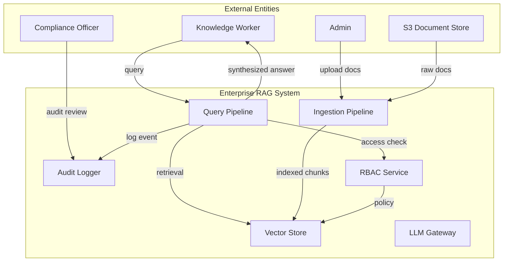
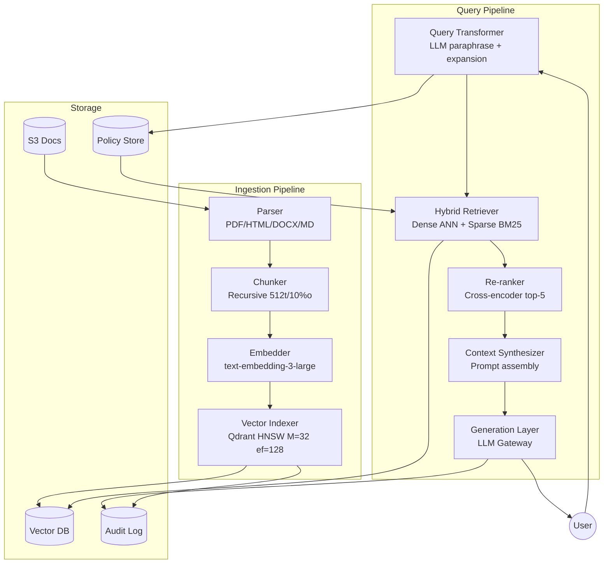

# Enterprise RAG System — Architecture & System Analysis Package

**Domain:** Financial Services | **Cloud:** AWS | **Compliance:** SOC 2 Type II + GDPR | **Scale:** 10M+ docs, P95 < 800ms, 99.9% uptime

---

## PART 1: Python Infrastructure Setup Script

```python
"""
enterprise_rag_setup.py
Idempotent pathlib-based directory scaffolding for Enterprise RAG documentation.
"""

import logging
import sys
from pathlib import Path

logging.basicConfig(
    level=logging.INFO,
    format="%(asctime)s [%(levelname)s] %(message)s",
    handlers=[logging.StreamHandler(sys.stdout)],
)
logger = logging.getLogger("rag_setup")

BASE = Path("./docs")
METADATA = {
    "01_requirement_analysis.md": """---
title: Requirement Analysis
part: 1
domain: Financial Services
compliance: SOC2 Type II, GDPR
---
""",
    "02_data_flow_diagrams.md": """---
title: Data Flow Diagrams
part: 2
notation: Mermaid.js
---
""",
    "03_spiral_sdlc_plan.md": """---
title: Spiral SDLC Plan
part: 3
loops: 3
quadrants: 4
---
""",
}


def setup_docs(base: Path = BASE) -> None:
    """Create docs/ directory and pre-populated markdown files idempotently."""
    try:
        base.mkdir(parents=True, exist_ok=True)
        logger.info("Ensured directory exists: %s", base.resolve())
    except PermissionError as exc:
        logger.error("Permission denied creating %s: %s", base, exc)
        sys.exit(1)

    for filename, header in METADATA.items():
        filepath = base / filename
        try:
            if filepath.exists():
                logger.warning("Skipping existing file: %s", filepath)
                continue
            filepath.write_text(header, encoding="utf-8")
            logger.info("Created: %s", filepath)
        except OSError as exc:
            logger.error("Failed to write %s: %s", filepath, exc)


if __name__ == "__main__":
    setup_docs()
```

---

## PART 2: Comprehensive Requirement Analysis

### Scope & Vision
Enterprise RAG system enabling knowledge workers to query 10M+ financial documents (contracts, filings, transcripts) with sub-800ms P95 latency, full audit trail, and SOC 2 / GDPR compliance.

### System Actors

| Actor | Type | Responsibility |
|---|---|---|
| Knowledge Worker | Human | Submit queries, review answers |
| Compliance Officer | Human | Audit log review, access policy |
| Admin | Human | Tenant onboarding, document ingestion |
| Vector DB | System | ANN indexing & retrieval |
| LLM Gateway | System | Model routing, token budgeting |
| Embedding Service | System | Vector generation, drift monitoring |
| Audit Logger | System | Immutable query/response logging |
| RBAC Service | System | Access control enforcement |

### Functional Requirements (FRs)

| ID | Requirement | Detail |
|---|---|---|
| FR-01 | Hybrid Search | Dense (cosine) + Sparse (BM25) fusion via RRF, k=60 |
| FR-02 | Context Re-ranking | Cross-encoder reranker, top-N=5, threshold ≥ 0.75 |
| FR-03 | RBAC | Tenant-isolated document access, role-based filtering pre-retrieval |
| FR-04 | Audit Logging | Immutable log of query, retrieved chunks, LLM prompt, response, timestamps |
| FR-05 | Document Ingestion | PDF, HTML, DOCX, Markdown → parse → chunk → embed → index |
| FR-06 | Metadata Filtering | Date range, department, classification tag filters applied pre-retrieval |
| FR-07 | Query Expansion | LLM paraphrase + multi-query retrieval with union merge |
| FR-08 | Source Citation | Every answer includes document ID + chunk offset + confidence score |

### Non-Functional Requirements (NFRs)

| ID | Metric | Target | Measurement |
|---|---|---|---|
| NFR-01 | Latency P95 | < 800ms end-to-end | Prometheus histogram |
| NFR-02 | Recall@K | > 0.85 @ K=10 | Offline evaluation set |
| NFR-03 | Throughput | ≥ 200 QPS per node | Locust / k6 load test |
| NFR-04 | Availability | 99.9% uptime | SLA monitor, 43.8h downtime/yr max |
| NFR-05 | Data Freshness | ≤ 15 min ingestion-to-search | Event timestamp delta |
| NFR-06 | Embedding Drift | KL divergence < 0.05/week | PCA monitoring |
| NFR-07 | Encryption | AES-256 at rest, TLS 1.3 in transit | Compliance scan |

### System & Architectural Constraints
- Data residency: EU documents must remain in eu-west-1
- Budget: infra cost ≤ $15K/month at steady state
- Regulatory: GDPR right-to-erasure within 30 days; SOC 2 audit trail immutable for 7 years
- Vendor lock-in: avoid proprietary cloud-native vector DBs; use self-hosted Qdrant on EKS

---

## PART 3: Data Flow Diagrams (Mermaid.js)

### DFD Level 0 — Context Diagram



### DFD Level 1 — Decomposed Data Flow



---

## PART 4: Spiral SDLC Plan (3 Loops × 4 Quadrants)

### Loop 1: Naive RAG Proof-of-Concept

**Q1 — Objectives, Alternatives, Constraints**
- **Objective:** Validate end-to-end retrieval + generation on 10K sample docs with < 2s latency.
- **Alternatives:** (A) LangChain naive chain, (B) Custom Python + FAISS, (C) LlamaIndex.
- **Constraints:** 2-week sprint, 1 engineer, open-source only, single-tenant.

**Q2 — Risks & Mitigation**

| Risk | Likelihood | Impact | Mitigation |
|---|---|---|---|
| Poor chunk quality | High | High | Test 3 chunk strategies (fixed/recursive/semantic), pick best F1 |
| Embedding model mismatch | Medium | Medium | Evaluate 2 models on recall@10 offline before commit |
| LLM hallucination | High | High | Groundedness check via NLI; reject if faithfulness < 0.7 |
| Scope creep | Medium | Medium | Hard freeze on features, PoC = query + answer only |

**Q3 — Engineering, Development, Testing**
- Implement ingestion pipeline (PDF parser → 512-token chunks → OpenAI embeddings → FAISS flat index).
- Build naive retrieval: embed query → top-5 cosine → prompt with context → LLM generate.
- Unit tests: chunk boundary correctness, embedding dimension consistency.
- Integration test: 100-sample QA set, measure latency + answer correctness manually.

**Q4 — Evaluation & Next Phase**
- Pass criteria: Recall@5 ≥ 0.60, P95 latency < 2s, 0 critical bugs.
- Go/no-go decision for Loop 2: Proceed if ≥ 70% of sample queries return correct answers.

---

### Loop 2: Advanced RAG Optimization

**Q1 — Objectives, Alternatives, Constraints**
- **Objective:** Achieve Recall@10 ≥ 0.85 and P95 < 800ms on full 1M document corpus.
- **Alternatives:** (A) Hybrid dense+sparse + rerank, (B) Query expansion only, (C) Metadata filtering only.
- **Constraints:** Must support RBAC, budget $8K/month infra, 4-week sprint.

**Q2 — Risks & Mitigation**

| Risk | Likelihood | Impact | Mitigation |
|---|---|---|---|
| Hybrid fusion mis-tuning | Medium | High | Grid search k₁, b, RRF k; validate on held-out set |
| Re-ranker latency blowup | High | Medium | Cache rerank scores, limit candidate pool to top-20 |
| RBAC leakage | Medium | Critical | Pre-filter chunks by tenant ID before LLM synthesis |
| Context window overflow | Medium | High | Dynamic chunk selection + sliding window compression |
| Vector index scalability | High | High | Switch FAISS → Qdrant HNSW with partitioning |

**Q3 — Engineering, Development, Testing**
- Implement hybrid retrieval: dense ANN (Qdrant) + BM25 (rank-bm25), fused via RRF k=60.
- Integrate cross-encoder reranker (BGE-Reranker, top-N=5).
- Add metadata filter layer: department, date range, classification.
- Implement query expansion: LLM generates 3 paraphrases, union merge results.
- Add RBAC pre-retrieval filter via policy store lookup.
- Load test: 200 QPS target, measure P95 latency and recall@10.
- Security test: tenant isolation penetration test.

**Q4 — Evaluation & Next Phase**
- Pass criteria: Recall@10 ≥ 0.85, P95 < 800ms, throughput ≥ 200 QPS, 0 RBAC leaks.
- Go/no-go for Loop 3: Proceed if all NFRs met in staging env for 1 week.

---

### Loop 3: Production Enterprise RAG

**Q1 — Objectives, Alternatives, Constraints**
- **Objective:** Multi-tenant, SOC 2-compliant, 99.9% available production deployment on 10M+ docs.
- **Alternatives:** (A) Self-hosted Qdrant on EKS, (B) Managed Pinecone, (C) Hybrid cloud.
- **Constraints:** SOC 2 Type II audit, GDPR right-to-erasure, eu-west-1 residency, $15K/month cap.

**Q2 — Risks & Mitigation**

| Risk | Likelihood | Impact | Mitigation |
|---|---|---|---|
| Data residency violation | Low | Critical | Enforce region pinning, automated compliance scan |
| Immutable audit log tampering | Medium | Critical | Write-once S3 + WORM, Merkle tree integrity checks |
| Vector drift degradation | Medium | High | Weekly drift detection (KL < 0.05), auto-reindex |
| Multi-tenant noisy neighbor | Medium | Medium | Per-tenant QPS limits, resource quotas on K8s |
| GDPR erasure incomplete | Low | Critical | Cascading delete: Vector DB + S3 + audit log (masking) |
| SLA breach under spike | Medium | High | Auto-scaling HPA, circuit breaker on LLM gateway |

**Q3 — Engineering, Development, Testing**
- Deploy Qdrant cluster on EKS (3 nodes, replicated, encrypted at rest).
- Implement multi-tenant index isolation: separate collections per tenant + shared embedding model.
- Build audit logger: append-only S3 with object lock, query/response/chunk metadata, 7-year retention.
- Implement GDPR erasure pipeline: delete vector points + S3 objects + audit masking.
- Set up monitoring: Prometheus + Grafana dashboards for latency, throughput, recall, drift.
- Chaos engineering: kill node, simulate LLM timeout, verify auto-recovery.
- SOC 2 audit rehearsal: evidence collection for access control, encryption, logging.
- Penetration test: tenant isolation, injection attacks, privilege escalation.

**Q4 — Evaluation & Next Phase**
- Pass criteria: 99.9% uptime (30d burn-in), P95 < 800ms at 200 QPS, Recall@10 ≥ 0.85, 0 critical security findings, SOC 2 evidence complete.
- Next phase planning: GraphRAG for entity-centric queries, agentic RAG for multi-step reasoning, cost optimization via embedding caching.
