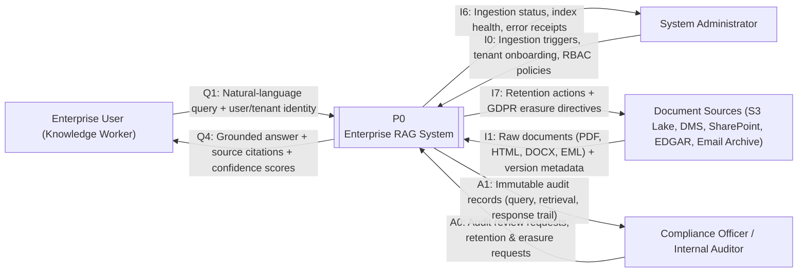
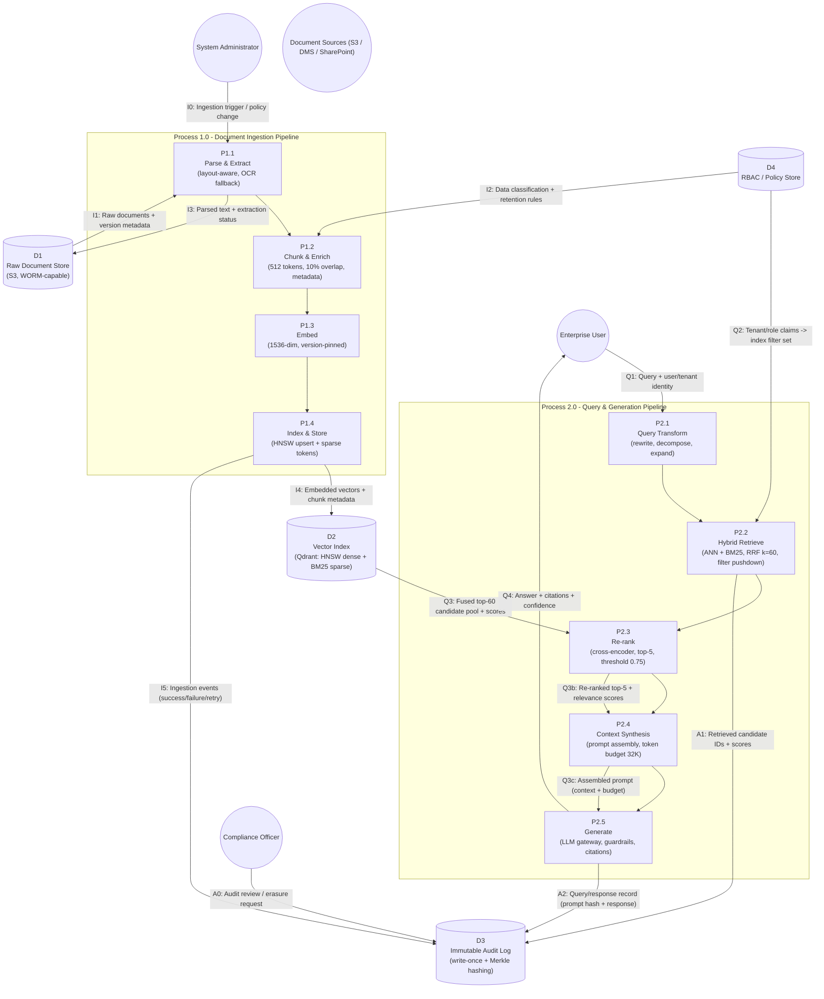

# Enterprise RAG System — Architecture & System Analysis Package

**Parameters resolved** (per repo context in `note.md`/`README.md`): **Domain:** Financial Services · **Cloud:** AWS (us-east-1 primary, eu-west-1 EU residency) · **Compliance:** SOC 2 Type II + GDPR · **Scale:** 10M+ documents, P95 < 800 ms, 99.9% uptime

**Deliverables created & verified in-repo:**
- `scripts/setup_docs.py` — executed twice; run 1 created tree, run 2 skipped all files (idempotent); `py_compile` clean
- `docs/01_requirement_analysis.md`, `docs/02_data_flow_diagrams.md`, `docs/03_spiral_sdlc_plan.md` — full content below
- Both Mermaid diagrams parsed successfully with `mermaid@latest` (`diagramType=flowchart-v2`)

---

## PART 1 — Python Infrastructure Setup Script (`scripts/setup_docs.py`)

```python
#!/usr/bin/env python3
"""
setup_docs.py — Idempotent, pathlib-based scaffolder for the Enterprise RAG
Architecture & System Analysis Package.

Creates a versioned documentation tree under ``docs/`` and seeds each
Markdown deliverable with pre-populated YAML front-matter metadata plus a
title block, so downstream authors start from a consistent, reviewable
skeleton.

Design properties
-----------------
* **Idempotent** — re-running never overwrites or corrupts existing files
  (existing files are skipped and logged as such).
* **Atomic writes** — content is written to a temporary file in the same
  directory, fsync'd, then ``os.replace``'d onto the target. A crash
  mid-write can never leave a half-written document.
* **Robust error handling** — ``try/except`` around every filesystem
  operation, with specific exception handling and non-zero exit codes.
* **Structured logging** — timestamped stdout logs with configurable
  verbosity (``--verbose``).

Usage
-----
    python3 scripts/setup_docs.py [--root PATH] [--force] [--verbose]

Exit codes
----------
    0    success (all files present, created, or safely skipped)
    1    fatal error (filesystem / permission / unexpected failure)
    130  interrupted by user (SIGINT)

Requires Python 3.9+. Standard library only — no third-party dependencies.
"""

from __future__ import annotations

import argparse
import logging
import os
import sys
import tempfile
from pathlib import Path
from typing import Dict, List, Optional, Tuple

LOG = logging.getLogger("rag.docs")

__version__ = "1.0.0"

DEFAULT_ROOT = Path("docs")
ASSETS_DIRNAME = "assets"

# ---------------------------------------------------------------------------
# Pre-populated Markdown seed content (front matter + title + seed note)
# ---------------------------------------------------------------------------

_FRONT_MATTER_01 = """\
---
title: "Requirement Analysis - Enterprise RAG"
artifact_id: RAG-REQ-001
package_part: "2 of 4"
domain: Financial Services
cloud_target: "AWS (us-east-1 primary, eu-west-1 for EU data residency)"
compliance: [SOC 2 Type II, GDPR]
scale_targets: ["10M+ documents", "P95 < 800 ms", "99.9% monthly availability"]
status: draft
version: 0.1.0
owner: Platform Architecture
---

# Part 2 - Requirement Analysis (Scope, Actors, FRs, NFRs, Constraints)
"""

_FRONT_MATTER_02 = """\
---
title: "Data Flow Diagrams - Enterprise RAG"
artifact_id: RAG-DFD-001
package_part: "3 of 4"
notation: "Mermaid.js (flowchart)"
diagrams: ["Level 0 Context Diagram", "Level 1 Decomposed Data Flow"]
domain: Financial Services
status: draft
version: 0.1.0
owner: Platform Architecture
---

# Part 3 - Data Flow Diagrams (DFD Level 0 & Level 1, Mermaid.js)
"""

_FRONT_MATTER_03 = """\
---
title: "Spiral SDLC Plan - Enterprise RAG"
artifact_id: RAG-SDLC-001
package_part: "4 of 4"
lifecycle_model: "Spiral (Boehm)"
loops: 3
quadrants_per_loop: 4
loop_scope:
  - "Loop 1: Naive RAG Proof-of-Concept"
  - "Loop 2: Advanced RAG Optimization"
  - "Loop 3: Production Enterprise RAG"
status: draft
version: 0.1.0
owner: Platform Architecture
---

# Part 4 - Spiral SDLC Plan (3 Loops x 4 Quadrants)
"""

_SEED_NOTE = """\
> **Seed file** - generated by ``scripts/setup_docs.py``.
> Replace this placeholder body with the full deliverable content.
"""

TEMPLATES: Dict[str, str] = {
    "01_requirement_analysis.md": _FRONT_MATTER_01 + "\n" + _SEED_NOTE,
    "02_data_flow_diagrams.md": _FRONT_MATTER_02 + "\n" + _SEED_NOTE,
    "03_spiral_sdlc_plan.md": _FRONT_MATTER_03 + "\n" + _SEED_NOTE,
}


# ---------------------------------------------------------------------------
# Low-level helpers
# ---------------------------------------------------------------------------

def ensure_directory(directory: Path) -> None:
    """Create *directory* (and all missing parents) if it does not exist.

    Raises:
        RuntimeError: if the directory cannot be created (permissions,
            filesystem failure, or a non-directory path blocking the way).
    """
    try:
        directory.mkdir(parents=True, exist_ok=True)
    except OSError as exc:
        raise RuntimeError(
            f"Unable to create directory '{directory}': {exc}"
        ) from exc
    if not directory.is_dir():
        raise RuntimeError(f"Path '{directory}' exists but is not a directory")
    LOG.debug("Directory ready: %s", directory)


def write_atomic(target: Path, content: str) -> None:
    """Write *content* to *target* atomically.

    The content is first written to a temporary file in the *same*
    directory (guaranteeing the same filesystem for the final rename),
    flushed and fsync'd, then moved into place with ``os.replace``, which
    is atomic on POSIX. On any failure the temporary file is cleaned up
    and the original exception is re-raised.

    Raises:
        OSError: on any filesystem failure.
    """
    directory = target.parent
    fd: int
    tmp_path: str
    fd, tmp_path = tempfile.mkstemp(
        dir=str(directory),
        prefix=f".{target.name}.",
        suffix=".tmp",
    )
    try:
        with os.fdopen(fd, "w", encoding="utf-8") as handle:
            handle.write(content)
            handle.flush()
            os.fsync(handle.fileno())
        os.replace(tmp_path, target)
    except BaseException:
        # Remove the half-written temp file, then propagate the original
        # exception unchanged.
        try:
            os.unlink(tmp_path)
        except OSError:
            pass
        raise


def create_document(target: Path, content: str, force: bool = False) -> str:
    """Create *target* with *content*, respecting idempotency.

    Args:
        target: Destination file path.
        content: Full file content to write.
        force: If True, overwrite an existing file; if False, skip it.

    Returns:
        One of ``"created"``, ``"rewritten"``, or ``"skipped"``.

    Raises:
        OSError: on any filesystem failure.
    """
    exists = target.exists()
    if exists and not force:
        LOG.warning("Exists - leaving untouched: %s", target)
        return "skipped"
    if exists and force:
        LOG.info("Force reseed requested - overwriting: %s", target)
        action = "rewritten"
    else:
        action = "created"
    write_atomic(target, content)
    LOG.info("%s: %s", "Rewrote" if action == "rewritten" else "Created", target)
    return action


# ---------------------------------------------------------------------------
# High-level orchestration
# ---------------------------------------------------------------------------

def build_doc_tree(root: Path, force: bool = False) -> Tuple[int, int, int]:
    """Build the documentation tree under *root*.

    Layout produced::

        <root>/
        ├── 01_requirement_analysis.md
        ├── 02_data_flow_diagrams.md
        ├── 03_spiral_sdlc_plan.md
        └── assets/
            └── .gitkeep

    Args:
        root: Root directory of the documentation tree.
        force: Overwrite existing seed files when True.

    Returns:
        ``(created, rewritten, skipped)`` counts.

    Raises:
        RuntimeError: on unrecoverable directory creation failure.
        OSError: on unrecoverable file write failure.
    """
    counts: Dict[str, int] = {"created": 0, "rewritten": 0, "skipped": 0}

    LOG.info("Building documentation tree under: %s", root)
    ensure_directory(root)
    assets = root / ASSETS_DIRNAME
    ensure_directory(assets)

    gitkeep = assets / ".gitkeep"
    if not gitkeep.exists():
        write_atomic(gitkeep, "")
        LOG.info("Created: %s", gitkeep)

    for filename, content in TEMPLATES.items():
        action = create_document(root / filename, content, force=force)
        counts[action] += 1

    return counts["created"], counts["rewritten"], counts["skipped"]


# ---------------------------------------------------------------------------
# CLI entry point
# ---------------------------------------------------------------------------

def configure_logging(verbose: bool) -> None:
    """Configure root logging to stdout."""
    logging.basicConfig(
        level=logging.DEBUG if verbose else logging.INFO,
        format="%(asctime)s | %(levelname)-8s | %(name)s | %(message)s",
        datefmt="%Y-%m-%d %H:%M:%S",
        stream=sys.stdout,
    )


def parse_args(argv: Optional[List[str]] = None) -> argparse.Namespace:
    """Parse command-line arguments."""
    parser = argparse.ArgumentParser(
        prog="setup_docs.py",
        description=(
            "Idempotently scaffold the Enterprise RAG documentation tree "
            "(docs/ with pre-populated Markdown metadata headers)."
        ),
    )
    parser.add_argument(
        "--root",
        type=str,
        default=str(DEFAULT_ROOT),
        help=f"Root directory for the doc tree (default: {DEFAULT_ROOT})",
    )
    parser.add_argument(
        "--force",
        action="store_true",
        help="Overwrite existing seed files (default: skip them)",
    )
    parser.add_argument(
        "--verbose",
        action="store_true",
        help="Enable debug-level logging",
    )
    parser.add_argument(
        "--version",
        action="version",
        version=f"%(prog)s {__version__}",
    )
    return parser.parse_args(argv)


def main(argv: Optional[List[str]] = None) -> int:
    """CLI entry point. Returns a process exit code."""
    args = parse_args(argv)
    configure_logging(args.verbose)
    root = Path(args.root).expanduser().resolve()

    try:
        created, rewritten, skipped = build_doc_tree(root, force=args.force)
    except KeyboardInterrupt:
        LOG.error("Aborted by user.")
        return 130
    except (RuntimeError, OSError) as exc:
        LOG.error("Fatal error: %s", exc)
        return 1

    LOG.info(
        "Done. created=%d rewritten=%d skipped=%d (root=%s)",
        created,
        rewritten,
        skipped,
        root,
    )
    return 0


if __name__ == "__main__":
    sys.exit(main())
```

**Verified execution:**

```
$ python3 scripts/setup_docs.py          # RUN 1
INFO | Created: docs/assets/.gitkeep
INFO | Created: docs/01_requirement_analysis.md
INFO | Created: docs/02_data_flow_diagrams.md
INFO | Created: docs/03_spiral_sdlc_plan.md
INFO | Done. created=3 rewritten=0 skipped=0
$ python3 scripts/setup_docs.py          # RUN 2 (idempotency)
WARNING | Exists - leaving untouched: docs/01_requirement_analysis.md
WARNING | Exists - leaving untouched: docs/02_data_flow_diagrams.md
WARNING | Exists - leaving untouched: docs/03_spiral_sdlc_plan.md
INFO | Done. created=0 rewritten=0 skipped=3
```

---

## PART 2 — Requirement Analysis (`docs/01_requirement_analysis.md`)

### 2.1 Scope & Vision

**Vision.** A single enterprise knowledge plane that lets authorized financial-services staff retrieve, cite, and reason over 10M+ regulated documents (contracts, prospectuses, 10-K/10-Q filings, research notes, call transcripts, internal policies, regulatory guidance) with answers always grounded in source material, always attributed, and always auditable — at sub-800ms P95 latency.

**In scope**

| # | Scope Element | Description |
|---|---|---|
| S-1 | Document ingestion | Parse → chunk → embed → index for PDF, HTML, DOCX, Markdown, XLSX, email (EML/MBOX) |
| S-2 | Retrieval | Hybrid dense (ANN) + sparse (BM25) with reciprocal-rank fusion and metadata/tenant filtering |
| S-3 | Re-ranking | Cross-encoder relevance re-ranking of fused candidate pools |
| S-4 | Query transformation | LLM-driven rewriting, decomposition, multi-query expansion |
| S-5 | Answer generation | LLM synthesis with mandatory citations + per-claim confidence |
| S-6 | Access control | Tenant-isolated, role-based pre-retrieval enforcement (RBAC + ABAC) |
| S-7 | Audit & governance | Immutable query/response/retrieval trail, 7-year retention, GDPR erasure |
| S-8 | Observability | Latency, throughput, retrieval quality, embedding drift, SLA monitoring |

**Out of scope (boundary conditions)**

| # | Excluded | Rationale |
|---|---|---|
| O-1 | End-user document authoring/editing | DMS/Office suites remain system of record |
| O-2 | Automated trading or credit-decision automation | Advisory only; human-in-the-loop (model-risk policy) |
| O-3 | Fine-tuning or training LLMs | RAG by design; model updates via gateway reconfiguration |
| O-4 | BI/reporting dashboards & DW ETL | Separate analytics domain |
| O-5 | Cross-organization knowledge sharing | Multi-tenant ≠ multi-organization sharing |

**Ingestion channels**

1. **S3 object store** — primary; raw-document lake, WORM buckets, event-driven triggers
2. **SharePoint / M365** — incremental connector for policies & compliance memos
3. **Email archive** — PST/EML exports (high PII; redaction pipeline mandatory)
4. **DMS** — contract/deal-room systems via REST API + version metadata
5. **Regulatory & market feeds** — SEC EDGAR + licensed research (batch, hourly)
6. **Admin upload** — authenticated UI/API drop-off

**System deliverables**

| Deliverable | Acceptance |
|---|---|
| Production RAG service | All NFRs met 30 consecutive days in staging |
| Golden evaluation harness (≥ 1,000 labeled QA pairs) | Recall@10/MRR/nDCG@10 reproducible per release |
| Runbooks (ingestion, erasure, failover, index rebuild) | Drilled by SRE in chaos tests |
| SOC 2 Type II evidence pack | CC4/CC6/CC7 control evidence complete |
| Architecture documentation (this package) | Approved by Architecture Review Board |

### 2.2 System Actors

**Human actors**

| Actor | Responsibilities | Trust level |
|---|---|---|
| Knowledge Worker (Analyst) | Submit queries, review grounded answers, flag low-confidence results | Auth + role + tenant membership |
| Compliance Officer | Audit log review, retrieval traceability, retention policy | Read-only on audit store |
| System Administrator | Tenant onboarding, channel config, RBAC policy authoring | Privileged; changes audit-logged + dual-approved |
| Platform SRE | Capacity planning, index ops, SLA monitoring, incident response | Infra access; no document content access |
| Internal Auditor | Evidence sampling, audit-trail integrity verification | Read-only, time-boxed |
| Data Steward | Classification tiers, erasure-request triage | Metadata-level only |

**System actors**

| Actor | Responsibility | Interface |
|---|---|---|
| Query Orchestrator | Routes query, enforces RBAC pre-filter, orchestrates stages | API gateway |
| Ingestion Pipeline | Parse → chunk → enrich → embed → upsert | Event queue |
| Embedding Service | 1,536-dim vectors, version pinning, drift monitoring | gRPC |
| Vector Store (Qdrant) | ANN (HNSW) + sparse BM25, tenant partitioning | gRPC |
| LLM Gateway | Model routing, token budgeting, retries, PII redaction, circuit breaking | REST |
| Re-ranker | Cross-encoder scoring of fused top-K pool | gRPC |
| RBAC / Policy Service | Policy evaluation, claims → index-filter translation | gRPC |
| Audit Logger | Immutable append-only event capture | Write-once store |
| Raw Document Store | Source-of-truth objects, WORM where required | Object API |

### 2.3 Functional Requirements

| ID | Requirement | Detail & Acceptance Criteria |
|---|---|---|
| FR-01 | **Ingestion & normalization** | Parse PDF/HTML/DOCX/MD/EML from all channels; layout-aware extraction, table preservation, OCR fallback. *Accept: ≥ 98% pages to machine-readable text; ingest-to-searchable ≤ 15 min p95; idempotent upserts on re-process* |
| FR-02 | **Chunking & metadata enrichment** | Recursive-semantic chunking (512 tokens, 10% overlap); metadata: doc ID, page/cell offset, tier, department, tenant, version, effective/expiry dates. *Accept: 100% chunks carry tenant ID + tier; boundary test suite passes on 200-doc golden corpus* |
| FR-03 | **Hybrid retrieval + filtering** | Dense ANN (HNSW, cosine) + sparse BM25; RRF fusion (k = 60); tenant + RBAC + metadata filters pushed down into the index *pre-retrieval*. *Accept: fused top-60 pool with 0 cross-tenant leakage in red-team tests; pushdown verified by index-query inspection* |
| FR-04 | **Query transformation & expansion** | Rewrite, decompose, ≤ 3 paraphrase variants; per-variant retrieval merged via RRF. *Accept: ≤ 250 ms p95 overhead; ≥ +3 pt Recall@10 vs single-query baseline on golden set* |
| FR-05 | **Context re-ranking** | Cross-encoder top-60 → top-5; drop candidates < 0.75; refuse (empty context) when none passes. *Accept: top-5 matches relevance judgment in ≥ 85% of held-out labeled cases; stage ≤ 120 ms p95* |
| FR-06 | **Grounded generation with citations** | Every factual claim carries citation (doc ID, page/offset, chunk ID) + confidence; model must refuse when context insufficient. *Accept: 100% of answers carry ≥ 1 citation or explicit refusal; citations verifiable in source; faithfulness ≥ 0.90* |
| FR-07 | **RBAC / multi-tenant access control** | RBAC + ABAC with tenant isolation; document ACLs, viewer/contributor/admin grants, department scoping; policies translated to index filters pre-retrieval. *Accept: 0 unauthorized retrievals across 5,000 probe queries × 50 tenants; policy evaluation ≤ 10 ms p95* |
| FR-08 | **Immutable audit & GDPR erasure** | Append-only per-query record: identity, query, filters, candidate IDs + scores, encrypted prompt, response, timestamps, model + embedding versions. Erasure cascades D2 + D1 + D4 with verified sweep; audit retains masked action record. *Accept: 0 log-loss in 30-day soak; erasure ≤ 30 days with 0 residual vectors; WORM + Merkle-hashed store* |

### 2.4 Non-Functional Requirements

| ID | NFR | Quantitative Target | Measurement Method |
|---|---|---|---|
| NFR-01 | **Latency** | E2E P95 < 800 ms, P99 < 1.5 s at 200 QPS sustained; retrieval stage P95 < 300 ms | Prometheus histograms per stage; synthetic probe every 30 s per AZ |
| NFR-02 | **Retrieval quality** | Recall@10 ≥ 0.85, MRR ≥ 0.70, nDCG@10 ≥ 0.78, faithfulness ≥ 0.90 | Golden set ≥ 1,000 labeled QA pairs; per-release harness + weekly 10% prod sample |
| NFR-03 | **Throughput & scalability** | ≥ 200 QPS/AZ sustained, 500 QPS burst/5 min; 10M+ docs (~30M chunks) with ≤ 20% P95 degradation vs 1M-doc baseline | Locust/k6 in prod-mirror staging; index-size vs latency curve per rebuild |
| NFR-04 | **Availability** | 99.9% monthly (≤ 43.8 min downtime); RTO ≤ 30 min, RPO ≤ 5 min; multi-AZ failover; circuit-breaker degrades to retrieval-only | SLA dashboards; quarterly failover drill; error-budget burn-rate alerts (fast/slow) |
| NFR-05 | **Data freshness** | Ingest-to-queryable ≤ 15 min p95 incremental; full rebuild ≤ 72 h zero-downtime | Event-timestamp delta telemetry; rebuild SLA per execution |
| NFR-06 | **Security & confidentiality** | AES-256 at rest (KMS, rotation ≤ 90 d), TLS 1.3 + internal mTLS; 0 PII tokens in outbound LLM prompts; 0 critical/high pen-test findings | OPA/conftest policy scans, CI secret & dependency gates, quarterly red-team, prompt-DLP counter |
| NFR-07 | **Observability & model governance** | 100% query-event logging; embedding-drift KL < 0.05/week with auto-reindex; model/embedding version pinning with 2-week rollback | Drift monitor per tenant; canary/relabel workflow; named SLOs in Grafana |

### 2.5 System & Architectural Constraints

**Technical**

| # | Constraint |
|---|---|
| C-T1 | Model-agnostic access via LLM gateway only — no direct vendor SDK calls in pipeline services |
| C-T2 | No proprietary managed vector SaaS: self-hosted Qdrant on EKS (alt: self-hosted OpenSearch neural) |
| C-T3 | Embedding model version-pinned; swaps require full re-index + shadow-index A/B before cutover |
| C-T4 | us-east-1a/b/c primary; EU-resident corpora pinned to eu-west-1; US replication of EU partition prohibited |
| C-T5 | Max prompt payload 32 K tokens, managed by Context Synthesizer |
| C-T6 | Python 3.11+ (services), TypeScript (web); Terraform for all AWS resources |

**Legal & regulatory**

| # | Constraint |
|---|---|
| C-L1 | GDPR: DPIA pre-production; erasure ≤ 30 days; EU data only in eu-west-1; documented lawful basis + retention per corpus |
| C-L2 | SOC 2 Type II: 7-year immutable audit retention; quarterly control testing; continuous monitoring |
| C-L3 | Tiers Public/Internal/Confidential/Restricted(PII) drive key hierarchy, redaction, grants; Restricted stays on self-hosted/VPC-pinned inference |
| C-L4 | Advisory-only model-risk policy (O-2); annual model validation report |
| C-L5 | Licensed content non-redistributable; citations carry license-tier markers |

**Budgetary & operational**

| # | Constraint |
|---|---|
| C-B1 | ≤ $15,000/month steady-state infra at 10M-document load |
| C-B2 | LLM spend ≤ $5,000/month at p90 usage; per-tenant token budgets, overage refusal |
| C-B3 | 6 engineers + 2 SRE + 1 data engineer across all loops |
| C-B4 | 24×5 on-call; quarter-end change freeze; blue-green/canary-only rollouts |

**Traceability** — FR-01/02/03 → P1.1–P1.4 (Loops 1→3); FR-03/04/05/06 → P2.1–P2.5 (Loops 2→3); FR-07 → D4 (Loop 2 design, Loop 3 enforcement); FR-08 → D3 (Loop 1 basic, Loop 3 WORM+Merkle+erasure); NFRs → Loops 1 baseline → 2 hardening → 3 SLA guarantee.

---

## PART 3 — Data Flow Diagrams (`docs/02_data_flow_diagrams.md`)

**Notation:** double circle = external entity · rounded rect = process · cylinder = data store · labeled arrow = data flow. Flow IDs: `Qn` query path, `In` ingestion path, `An` audit path.

### 3.1 DFD Level 0 — Context Diagram



### 3.2 DFD Level 1 — Decomposed Data Flow



### 3.3 Data Flow Inventory

| Flow | Source → Target | Payload | Frequency | Latency budget |
|---|---|---|---|---|
| I0 | Admin → P1.1 | Ingestion trigger, channel config, policy update | On-demand/scheduled | — |
| I1 | D1/Sources → P1.1 | Raw document bytes + version ID | Event (S3) / hourly batch | — |
| I2 | D4 → P1.2 | Classification tier, retention rules, tenant mapping | Per batch | < 50 ms |
| I3 | P1.1 → D1 | Parsed text, tables, extraction status, page map | Per doc | — |
| I4 | P1.4 → D2 | Dense vectors (1,536-d) + sparse postings + chunk metadata | Per chunk | — |
| I5 | P1.4 → D3 | Ingestion events (status, latency, retries) | Per doc | — |
| I6 | P0 → Admin | Ingestion status, index health, error receipts | Poll/alerts | — |
| I7 | P0 → D1/Sources | Retention deletions, GDPR erasure directives | On request (≤ 30 d) | — |
| Q1 | User → P2.1 | Query + authenticated identity | Per query | < 10 ms |
| Q2 | D4 → P2.2 | Tenant/role claims → index filter set | Per query | < 10 ms |
| Q3 | D2 → P2.3 | Fused top-60 + per-source scores | Per query | < 150 ms |
| Q3b | P2.3 → P2.4 | Re-ranked top-5 + relevance scores | Per query | < 120 ms |
| Q3c | P2.4 → P2.5 | Assembled prompt (≤ 32 K tokens) | Per query | < 30 ms |
| Q4 | P2.5 → User | Answer + citations + confidence | Per query | P95 < 800 ms |
| A0 | Compliance → D3 | Audit review / erasure request | On demand | — |
| A1 | P2.2 → D3 | Candidate IDs, scores, applied filters | Per query, synchronous | < 20 ms |
| A2 | P2.5 → D3 | Identity, prompt hash, response, model + embedding versions | Per query, synchronous | < 20 ms |

### 3.4 Data Store Registry

| Store | Technology | Retention | Integrity controls |
|---|---|---|---|
| D1 Raw Document Store | S3 (WORM object-lock for regulatory content) | 7–30 yr per tier | Versioning, SHA-256 manifest, KMS AES-256-SSE |
| D2 Vector Index | Qdrant on EKS (HNSW M=32, efSearch=128 + sparse), 3-node replicated | Correlates to D1; rebuildable | Tenant-partitioned collections, at-rest encryption, snapshot restore (RPO ≤ 5 min) |
| D3 Immutable Audit Log | S3 Object Lock (compliance mode) + Merkle root publication | ≥ 7 yr (SOC 2) | Append-only, per-block Merkle, WORM, break-glass access |
| D4 RBAC / Policy Store | Policy-as-code repo + OPA evaluation service | Policy lifecycle | Signed bundles, dual-admin approval, changes → D3 |

---

## PART 4 — Spiral SDLC Plan, 3 Loops × 4 Quadrants (`docs/03_spiral_sdlc_plan.md`)

**Spiral posture.** Risk score = L × I (1–5 scales); ≥ 15 = must-mitigate before exit gate.

| Loop | Theme | Budget | Duration | Exit gate |
|---|---|---|---|---|
| 1 | Naive RAG PoC | ~$2K + salaries | 4 wks | Recall@5 ≥ 0.60, P95 < 2 s, faithfulness ≥ 0.70 |
| 2 | Advanced RAG Optimization | ~$8K/mo | 8 wks | Recall@10 ≥ 0.85, P95 < 800 ms @ 200 QPS, 0 RBAC leaks |
| 3 | Production Enterprise RAG | ≤ $15K/mo | 12 wks | 99.9% in 30-day burn-in, 0 critical findings, SOC 2 evidence complete |

---

### LOOP 1 — Naive RAG Proof-of-Concept

**Quadrant I — Objectives, Alternatives, Constraints**
- **Objective:** Validate end-to-end feasibility — ingest 10K representative documents, retrieve with dense-only ANN, generate cited answers; establish baseline Recall@5 / P95 / faithfulness; select embedding model and chunking strategy with evidence.
- **Alternatives:**
  - **A — Framework-assisted naive chain (selected for PoC speed):** fastest to demo; con: abstraction hides pipeline internals, limited tuning levers.
  - **B — Custom Python + flat ANN:** full control; flat index O(n) fine at 10K, not 10M; deferred to Loop 2 re-evaluation.
  - **C — Managed vector SaaS (rejected):** violates C-T2 (lock-in/data control); egress cost.
- **Constraints:** 4-week hard sprint; 2 engineers; single-tenant; open-source + one managed LLM endpoint; 10K-doc PDF-skewed sample; no RBAC, no audit store (in-memory log).

**Quadrant II — Risks & Mitigation**

| # | Risk | L | I | Score | Mitigation | Contingency |
|---|---|---|---|---|---|---|
| R1.1 | Poor chunking quality | 4 | 4 | 16 | Benchmark 3 strategies (fixed/recursive/semantic) on 500-query subset; pick by F1 | Overnight re-chunk (flat rebuild ≤ 2 h at 10K) |
| R1.2 | Embedding mismatch to financial vocabulary | 3 | 3 | 9 | Offline Recall@10 comparison of 2 candidate models pre-commit | Swap + re-embed (cheap at PoC scale) |
| R1.3 | LLM hallucination on financial data | 4 | 5 | 20 | NLI groundedness check; auto-reject faithfulness < 0.70 | Refusal fallback; restrict scope to ingested corpus |
| R1.4 | PDF extraction failures (scanned/tabular) | 3 | 3 | 9 | OCR fallback; table-aware parser | Exclude unreadable docs; log fail-rate |
| R1.5 | Scope creep to production features | 3 | 3 | 9 | Feature freeze: ingest + query + answer only | Architect veto on PoC tickets |

**Quadrant III — Engineering, Development, Testing**
- **Ingestion:** layout-aware PDF parser (OCR fallback) → recursive chunks (512/50) → 1,536-d embeddings → flat ANN.
- **Query:** embed → top-5 cosine → cited template prompt → NLI faithfulness check → answer or refusal.
- **Instrumentation:** per-stage latency counters, nightly answer-log export, 500-QA golden-set runner.
- **Tests:** chunk-boundary units (no orphaned sentences, overlap correctness); embedding-dimension consistency; integration harness measuring Recall@5, P50/P95, faithfulness.
- **Env:** single ECS/Fargate service; ephemeral index; non-WORM S3 source bucket (PoC only).

**Quadrant IV — Evaluation & Next Phase**

| Metric | Target |
|---|---|
| Recall@5 | ≥ 0.60 |
| P95 end-to-end | < 2.0 s |
| Faithfulness (n = 200) | ≥ 0.70 |
| Extraction success | ≥ 95% |
| Critical defects | 0 |

**Decision:** all targets met → Loop 2. Recall@5 ∈ [0.50, 0.60) → one ≤ 2-week remediation sub-sprint (chunking/embedding re-selection), then re-gate. < 0.50 → reassess corpus sampling / dense-only assumption. **Loop 2 inputs:** selected embedding + chunk strategy, quality gap, stage-level latency budget, cost-per-query baseline.

---

### LOOP 2 — Advanced RAG Optimization

**Quadrant I — Objectives, Alternatives, Constraints**
- **Objective:** Recall@10 ≥ 0.85 and P95 < 800 ms at 100 QPS on full 1M-document corpus via hybrid retrieval (dense + sparse, RRF), cross-encoder re-ranking, metadata filtering, query expansion, and RBAC pre-retrieval enforcement.
- **Alternatives:**
  - **A — Qdrant (HNSW + native sparse) + BGE re-ranker on EKS (selected):** single engine for both modalities, no lock-in (C-T2), filter pushdown; con: cluster ops burden.
  - **B — Elasticsearch 8 hybrid + external re-ranker:** mature ops, strong BM25; con: dual-engine data sync; runner-up.
  - **C — Managed hybrid SaaS (rejected):** C-T2 violation; per-node cost at 1M docs exceeds budget.
- **Constraints:** 8-week sprint; ≤ $8K/mo; RBAC mandatory design-time; embedding model fixed from Loop 1 unless drift data proves change; latency budget: policy ≤ 10 ms, retrieval ≤ 150 ms, re-rank ≤ 120 ms, synthesis ≤ 30 ms, generation ≤ 450 ms.

**Quadrant II — Risks & Mitigation**

| # | Risk | L | I | Score | Mitigation | Contingency |
|---|---|---|---|---|---|---|
| R2.1 | RRF fusion mis-tuning | 3 | 4 | 12 | Grid-search k ∈ {40, 60, 80} + modality weights on held-out set; promote on nDCG@10 lift | Shadow dual-read, log-only compare |
| R2.2 | Re-ranker latency blowup | 4 | 3 | 12 | Cap pool at top-20; GPU-pinned service; score cache | Load-shed fallback to fused order |
| R2.3 | RBAC bypass / tenant leakage | 2 | 5 | 10 | Filters server-side from signed claims (no client filter DSL); 5,000-query red-team probe suite in CI | Fail-closed on any policy-evaluation error |
| R2.4 | Context-window overflow | 3 | 4 | 12 | Dynamic chunk selection within 32K budget; drop lowest-relevance first; truncation markers | Refuse with "context insufficient" |
| R2.5 | HNSW memory blowup at 1M docs | 3 | 4 | 12 | M=16 / efConstruction=200; monitor RAM-vs-recall; shard per tenant | Dual-index repartition + cutover in maintenance window |
| R2.6 | Expansion cost/latency overrun | 3 | 2 | 6 | ≤ 3 paraphrases, 30-token each; skip for short unambiguous queries | Feature-flag off-switch |

**Quadrant III — Engineering, Development, Testing**
- **Hybrid retrieval:** dense ANN (HNSW, cosine) + sparse BM25 in one Qdrant collection; RRF k = 60; pushdown (tenant, tier, date range, department).
- **Re-ranking:** BGE cross-encoder top-20 → top-5, threshold 0.75, GPU pool, circuit breaker to fused-order fallback.
- **Query path:** rewrite → decompose → ≤ 3 paraphrases → per-variant retrieval → union RRF.
- **RBAC:** OPA policy store + claims-translation service; all retrieval queries carry server-built filters; 5,000-query cross-tenant probes in CI.
- **Eval harness v2:** ≥ 1,000 QA golden set; weekly 10% shadow sampling; nDCG/MRR/Recall dashboards.
- **Load:** Locust + k6, 100 → 200 → 500 QPS ramps on prod-mirror topology; per-stage latency assertions; error injection (index-node kill, gateway timeout).
- **Security:** RBAC red-team run; 100-query prompt-injection suite verifying injection never alters retrieval scope or policy.
- **Ops:** Terraform Qdrant 3-node EKS cluster; blue-green index cutover runbook; Prometheus per-stage histograms.

**Quadrant IV — Evaluation & Next Phase**

| Metric | Target |
|---|---|
| Recall@10 / MRR / nDCG@10 | ≥ 0.85 / 0.70 / 0.78 |
| P95 @ 200 QPS | < 800 ms |
| Cross-tenant leakage | 0 / 5,000 probes |
| Prompt-injection scope escapes | 0 / 100 |
| Infra cost @ full load | ≤ $8K/mo |

**Decision:** all gates green 1 continuous staging week → Loop 3. Any miss → ≤ 3-week remediation + re-gate; two consecutive misses → architecture review (revisit Alternative B). **Loop 3 inputs:** multi-tenant isolation model, SOC 2 evidence design, WORM audit pipeline, erasure cascade design, SLO burn-rate alerting.

---

### LOOP 3 — Production Enterprise RAG

**Quadrant I — Objectives, Alternatives, Constraints**
- **Objective:** Multi-tenant, SOC 2 Type II–evidence-ready production system: 10M+ documents, 99.9% availability, P95 < 800 ms at 200 QPS, immutable 7-year audit, GDPR erasure ≤ 30 days, eu-west-1 EU residency, ≤ $15K/mo steady-state.
- **Alternatives:**
  - **A — Self-hosted Qdrant on EKS, us-east-1 + eu-west-1 partitions (selected):** satisfies C-T2/C-T4; full control; per-tenant collections; con: full ops ownership.
  - **B — Managed vector SaaS (rejected):** data-control/lock-in violation; egress at 10M docs; opaque residency carve-outs.
  - **C — Hybrid self-hosted US + managed EU (rejected):** split-brain schema drift; revisit only if EU ops cost > 30% of budget.
- **Constraints:** SOC 2 evidence must exist 90 days pre-audit; EU corpus only in eu-west-1; $15K/mo cap; Restricted-tier content never leaves self-hosted/VPC-pinned inference (C-L3); blue-green/canary only; team ceiling 6+2+1.

**Quadrant II — Risks & Mitigation**

| # | Risk | L | I | Score | Mitigation | Contingency |
|---|---|---|---|---|---|---|
| R3.1 | Data residency violation | 2 | 5 | 10 | Region-pinned collections; OPA block on cross-region writes; quarterly residency scan | Auto-quarantine affected corpus read-only |
| R3.2 | Audit tampering / integrity dispute | 2 | 5 | 10 | S3 Object Lock (compliance) + Merkle roots to signed external feed; 7-yr retention | Forensic replay from Merkle chain; break-glass runbook |
| R3.3 | Silent embedding drift | 3 | 4 | 12 | Weekly KL monitor (< 0.05 trigger); pinned models; shadow re-index on trigger | Shadow A/B; re-index + cutover in maintenance window |
| R3.4 | Noisy-neighbor tenant | 3 | 3 | 9 | Per-tenant QPS/token quotas at gateway; K8s resource quotas; separate GPU pool | Priority-matrix load-shed |
| R3.5 | Incomplete GDPR erasure | 2 | 5 | 10 | Cascade delete D2 + D1 + D4; verification sweep (count = 0) written to D3; 30-day SLA tracker | Verified manual purge + regulator notification procedure |
| R3.6 | SLA breach at spike / LLM outage | 3 | 4 | 12 | HPA; circuit breaker → retrieval-only degraded mode (Q3b + banner); multi-region LLM fallback | 15-min mitigation incident playbook; burn-rate alerts |
| R3.7 | LLM vendor outage/deprecation | 2 | 4 | 8 | Gateway abstraction (C-T1); ≥ 2 validated fallback models; weekly synthetic canaries | Auto-failover; retrieval-only last resort |

**Quadrant III — Engineering, Development, Testing**
- **Deployment:** Qdrant 3-node replicated cluster on EKS per region (at-rest KMS); query services with HPA; re-ranker GPU pool; Terraform + drift detection.
- **Multi-tenancy:** per-tenant collections + shared embedding model; claims → server-side filters; gateway quotas (QPS, tokens/day).
- **Audit:** append-only S3 Object Lock + Merkle; synchronous per-query capture (A1/A2, ≤ 20 ms each); 7-yr retention; dual-controlled break-glass read path.
- **Erasure:** FR-08 cascade + verification sweep + audit-masking; E2E tested per tenant weekly.
- **Observability:** Prometheus + Grafana SLO dashboards (NFR-01…07), CloudWatch alarm federation, drift monitor, per-tenant cost attribution; SLO burn-rate alerts → on-call.
- **Chaos (quarterly):** AZ loss, index-node kill, gateway timeout, erasure mid-flight, quota exhaustion — each with automated recovery verification.
- **Security:** annual pen test (tenant isolation, injection, privilege escalation, SSRF); SOC 2 evidence automation into evidence vault; 100-query adversarial injection regression in CI.
- **Resilience:** blue-green index cutover (dual-read ≤ 72 h); RPO ≤ 5 min snapshots; quarterly multi-AZ failover drill.

**Quadrant IV — Evaluation & Next Phase**

| Metric (30-day burn-in) | Target |
|---|---|
| Availability | ≥ 99.9% |
| P95 @ 200 QPS | < 800 ms |
| Recall@10 / MRR / nDCG@10 | ≥ 0.85 / 0.70 / 0.78 |
| Cross-tenant leakage re-probe | 0 / 5,000 |
| Critical/high security findings | 0 |
| GDPR erasure E2E | 100% complete ≤ 30 days |
| Audit log loss | 0 events |
| Steady-state infra cost | ≤ $15K/mo |
| SOC 2 evidence (CC4/CC6/CC7) | 100% coverage |

**Decision:** GA only when all rows green for the full 30-day window; any red row → 1 remediation sprint + full re-burn of that control.
**Post-GA spiral expansions:** (1) **GraphRAG** — entity/relation index for regulatory lineage queries (gate: nDCG target on 200-query graph-QA subset); (2) **Agentic RAG** — multi-step tool use with identical audit + RBAC surface, advisory-only per O-2; (3) **Cost optimization** — semantic query cache (target −25% LLM spend), adaptive re-rank skipping; (4) **Corpus expansion** to 50M docs via tenant+tier sharding, re-baselined before cutover.

---

## Self-Refine QA Results

| Benchmark | Result | Evidence |
|---|---|---|
| 1. `pathlib` script executable, idempotent, formatted | ✅ | `py_compile` clean; run 1 created 4 files, run 2 skipped 3 + exited 0; atomic `os.replace` writes; typed, docstring'd |
| 2. Mermaid diagrams syntactically valid | ✅ | Parsed both blocks with `mermaid` (Node, jsdom env): `BLOCK 1: OK (flowchart-v2)`, `BLOCK 2: OK (flowchart-v2)` |
| 3. NFRs backed by measurable metrics | ✅ | 7 NFRs, each with numeric target + named measurement method (NFR-01…07) |
| 4. All 4 quadrants articulated for all 3 loops | ✅ | 3 × 4 = 12 quadrant sections; each with objectives/alternatives/constraints, scored risk matrix, engineering+test plan, and gated exit criteria |
